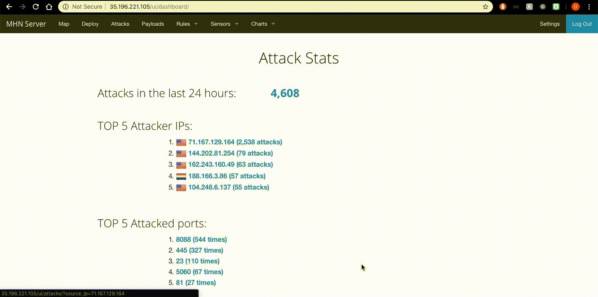

# Web-Security-Week-9
# Week9-web-security
## Which Honeypot(s) you deployed
- mhn-honeypot-1

## Any issues you encountered
- I spent 15 hours to figure it out because it always has some permission denied.

## A summary of the data collected: number of attacks, number of malware samples, etc.
 - 
 - 
 - 

## Any unresolved questions raised by the data collected
 - No
